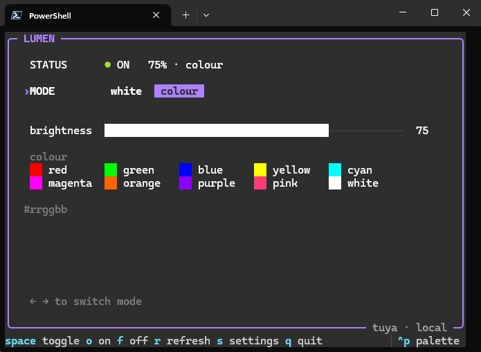

<div align="center">

# Lumen


</div>

A minimal terminal app to interact with Tuya/SmartLife based smart bulbs. Works entirely on Local LAN, with no cloud round-trip, or hub requirement. Commands land instantly and keep working even with the internet down, because nothing leaves the network.

<div align="center">



</div>

## Why it exists & what it does differently

Local Tuya control is well-covered ground, but almost all of it is a *plugin* — `tuya-local` and `localtuya` run inside Home Assistant, `homebridge-tuya` inside Homebridge. Standing up a hub to toggle one device is absurd. The rest are libraries: `tinytuya` and `tuyapi` are things you write code against, not things you run.

Lumen on the other hand is a standalone app. No hub, no plugin, and no code to write; it is built such that anyone with minimal technical knowledge can set up their device, and control it with a very clean and minimal UI.

## Install Lumen

### WINDOWS

1. Download the zip from the [Latest Release](https://github.com/exorev07/Lumen/releases) and unzip it.

2. Shift + right-click inside the unzipped folder and choose **Open in Terminal** (or **Open PowerShell window here**), then run:

   ```powershell
   Unblock-File .\install.ps1, .\uninstall.ps1
   .\install.ps1
   ```

   **Note:** Double-clicking `install.ps1` will not work, Windows opens `.ps1` files in Notepad instead of running them. `Unblock-File` clears the flag Windows puts on downloaded scripts; without it PowerShell refuses to run the installer — [see below](#windows-may-warn-you-about-it).

3. Open a **new** terminal (a running one cannot see the PATH change) and run:

   ```powershell
   lumen
   ```

The installer copies Lumen to your user profile and puts it on your PATH, so `lumen` works from any terminal. No admin rights are needed, nothing is written outside your own profile, and `uninstall.ps1` undoes it. Pass `-NoPath` if you would rather it did not touch your PATH; `lumen\lumen.exe` also runs fine straight from the folder you unzipped, without installing anything.

Requires **Windows 10 or 11, 64-bit (x64)**; there is no ARM64 build yet, so it will not run on a Windows-on-ARM device such as a Surface Pro X. Windows will probably warn you the first time — [see below](#windows-may-warn-you-about-it).

### FROM SOURCE (ANY PLATFORM)

If Python 3.11 or newer is already installed on your machine:

```
git clone https://github.com/exorev07/Lumen
cd Lumen
pip install .
lumen
```

Either way, press `s` on first run and follow the steps to get your device's key, which Lumen needs before it can control anything. [Setup](#setup) below covers the same ground in more detail.

### Windows may warn you about it

The first time you run `lumen.exe`, Windows SmartScreen will likely show you a blue "Windows protected your PC" warning. You can safely click **More info**, and then **Run anyway**.

Some antivirus tools may also flag it, or quietly quarantine it.

**The same applies to `install.ps1`,** which PowerShell refuses to run at all, reporting that it "is not digitally signed". This is Windows' default behaviour for any script downloaded from the internet, not something unusual about this one, and [step 2](#windows) in the installation section above clears it with `Unblock-File`.

`Unblock-File` only affects the files you name, which is why it is better than changing your execution policy, that would lower the bar for every script on the machine, and this one does not need that.

All of this happens because the binary is **unsigned** as of now. A code-signing certificate costs a few hundred dollars a year, which this project does not currently justify, and unsigned installers bundled by PyInstaller are a common source of false positives, the same warning appears for a great deal of open-source Windows software.

You do not have to take that on trust. Every release lists the SHA-256 of the download, and you can check the file you got against it, substituting the name of the zip you actually downloaded:

```powershell
Get-FileHash .\Lumen-0.1.1-win-x64.zip -Algorithm SHA256
```

If the hash matches the one on the release page, the file is byte for byte what was published. You can also read every line of what went into it (that is the whole repository) and [build it yourself](packaging/README.md) if you would rather not run someone else's binary at all.

## Setup

The bulb encrypts every local command with a key that only Tuya issues, so you need your device's ID and local key once. Press `s` in the app and it explains each step; the short version:

1. You need to pair your device with the router (network) in the Smart Life app first. Lumen controls devices already on your WiFi, it can not pair them.
2. Create a free Cloud project at [iot.tuya.com](https://iot.tuya.com), and choose the correct **data centre for your Smart Life account's region**. Wrong region may return no devices.
3. Subscribe the project to *IoT Core*, *Authorization* and *Smart Home Scene Linkage*.
4. Select **Devices → Link Tuya App Account**, and scan the QR code with the Smart Life app on your phone.
5. Install and run `tinytuya`'s wizard, which is what actually fetches the key:

   ```
   pip install tinytuya
   python -m tinytuya wizard
   ```

6. Give the wizard the **Access ID** and **Access Secret** from your project's overview page, and the data centre you picked in step 2.
7. The wizard writes a `devices.json` file in whichever folder you ran it from. Find your bulb in it and copy out its `"id"` and `"key"` — those are the **Device ID** and **Local Key** that go in Lumen's settings window.
8. The IP is optional, you can leave it blank, Lumen scans for the bulb automatically and then stores where it found it. A DHCP change costs one ~12s rescan and fixes itself.

> **This step needs Python, even if you downloaded the Lumen.exe on Windows.** The wizard is a separate tool that talks to Tuya's cloud, and it is currently the only way to get a local key out of them; the Smart Life app never shows it to you. You only ever do this once, and nothing touches the cloud again afterwards. Folding the wizard into Lumen's own settings window, so that none of this is needed, is the next thing planned.

### Where settings live

`lumen config` prints the path. It is a small TOML file in your user config directory:

| | |
| --- | --- |
| Windows | `%APPDATA%\lumen\config.toml` |
| macOS | `~/Library/Application Support/lumen/config.toml` |
| Linux | `$XDG_CONFIG_HOME/lumen/config.toml`, else `~/.config/lumen/` |

The Windows path is the one in daily use; the macOS and Linux paths follow the usual convention for each platform but have not yet been exercised on a real machine. If Lumen puts its config somewhere surprising on yours, that is worth an issue.

Note: It holds your local key, so **do not commit or share it**.

## Using the app

Run `lumen` with no arguments in a terminal window and you get the interface:

| key | does |
| --- | --- |
| `↑` `↓` or `tab` | move between controls |
| `←` `→` | adjust a bar, or switch mode / pick a swatch |
| `shift` + `←` `→` | single steps |
| `home` / `end` | jump a bar to its limits |
| `space` | toggle power |
| `o` / `f` | force on / off |
| `r` | refresh, and reconnect if the bulb dropped |
| `s` | settings |
| `q` | quit |

Every key works at any valid window size. The hint bar along the bottom shows fewer of them on a narrow terminal rather than cutting labels in half, so it may list less than the table above but the keys themselves still work fine.

The mouse works too: click a mode to switch, click a colour to set it, click anywhere on a bar to jump to that level, or drag to scrub. Controls that mean nothing in the current mode are hidden, like warmth in colour mode, and the swatches in white mode.

For scripts, each action is also a subcommand:

```
lumen status
lumen on | off | toggle
lumen brightness 60         # 1-100
lumen color red             # a name, or "#RRGGBB"
lumen warm 80               # 0 = cool, 100 = warm
lumen config                # where settings are stored
```

Named colours: red, green, blue, yellow, cyan, magenta, orange, purple, pink, white.

> On PowerShell, please quote hex colours. `#` starts a comment, so for example `lumen color #ff8800` silently drops the value, hence use `lumen color "#ff8800"`.

## Supported devices

The app was developed against a `Syska SSK-SMW-12W-5C` (12W B22D RGB), but nothing here is Syska-specific: it works with `Tuya protocol 3.3` to a category `dj` (standard colour light) device, so most Tuya/SmartLife colour bulbs should work — though that is an argument from how the protocol works, not a claim anyone has verified. If yours does, or does not work, please open an issue: with a sample size of one, that is the most useful thing you can contribute right now.

Lumen talks to one bulb at a time for the moment — it holds a single connection and a single set of credentials. Multi-device support is planned, and will need contributions.

## Project status

Lumen is early but usable: everything documented here works, and it is what I use to drive my own bulb daily. Obviously, it is still a work in progress, so please be patient if you experience some occasional rough edges and expect things to keep getting better — multi-device support, audio-reactivity, and a few other features are planned and can be contributed.

One **limit** is worth knowing before you start, and it is about breadth of testing rather than anything known to be broken: only **Windows** has been tested during development. macOS and Linux should be fine — the code is pure Python and the platform-specific part is just choosing a config directory. The same goes for the bulb itself, as covered in [Supported devices](#supported-devices).

Reports either way are genuinely useful, working or not.

## If the app does not start

Almost always one of two things, both specific to the `.exe`:

- **The display is garbled, or colours and borders look wrong.** Run it from [Windows Terminal](https://aka.ms/terminal) rather than from the older `conhost` console window. Lumen draws a full-screen interface, and the legacy console renders it poorly. Windows 11 uses Windows Terminal by default, so this mostly affects Windows 10 or older distributions.
- **"VCRUNTIME140.dll was not found", or it exits instantly with no message.** Install the [Microsoft Visual C++ Redistributable (x64)](https://aka.ms/vs/17/release/vc_redist.x64.exe). It ships with Windows 10 and 11, so this is rare, but a freshly imaged machine can be missing it.

The Python install should have neither problem. If something else goes wrong, please [open an issue](https://github.com/exorev07/Lumen/issues) — including what Windows version you are on is genuinely useful, since this has so far only been run on my machine.

## If it stops working after setup

Please look into [TROUBLESHOOTING.md](TROUBLESHOOTING.md). The most-likely cause is a rotated local key, which happens on re-pairing the bulb to a new WiFi network. The fix is to run the wizard again as in step 5 of [Setup](#setup) and paste the new **Local Key** into Lumen's settings window — your Access ID and Access Secret do not change, and neither does the device ID. You can avoid this by keeping the same SSID while moving the routers. An expired Tuya free trial does not affect local control at all, it only blocks re-fetching the key.

## Development

```
git clone https://github.com/exorev07/Lumen
cd Lumen
pip install -e .
```

`src/lumen/device.py` is the transport and knows nothing about the UI, `tui.py` is the interface, `cli.py` is the command line, and `config.py` loads and saves settings. The modules carry fairly dense comments about the decisions behind them, particularly the threading rules in `tui.py`, where every call into the bulb blocks on a socket.

## Contributing

Lumen is open source under the MIT licence — the whole thing is in this repository, and you are welcome to read it, fork it, change it, or ship something built on it.

The gaps in this project are mostly things one person cannot close alone, so there is a lot here worth picking up:

- **Add your bulb to the tested list.** It has been verified against exactly one device, so every model someone confirms widens what the project can honestly claim. Try yours and [open an issue](https://github.com/exorev07/Lumen/issues) with the make, model and whether it connected — working or not, both are worth knowing.
- **Get it running on macOS or Linux.** The code is pure Python and the only platform-specific part is the config directory, so it should already work; it just needs someone to run it and fix whatever turns out not to.
- **Fix a bug you hit.** The modules carry dense comments explaining why they are the way they are, so it is usually possible to work out what a piece of code was meant to do before changing it.
- **Build something on the roadmap.** [Project status](#project-status) lists what is planned — folding the setup wizard into the app, multi-device support and audio-reactivity are the three big ones, and the first of those would help the most people.

Fork it, and [Development](#development) covers the layout. Small fixes can go straight to a pull request; for anything large, open an issue first so two people do not build the same thing twice.

## Licence

MIT — see [LICENSE](LICENSE). In short: use it for anything, including commercially, as long as the copyright notice travels with it.

The Windows download also bundles the Python runtime and seventeen third-party libraries (MIT, BSD, Apache-2.0 and MPL-2.0). Their licences ship with it as `THIRD-PARTY-LICENSES.txt`, and `lumen --licence` prints Lumen's licence together with all of them.